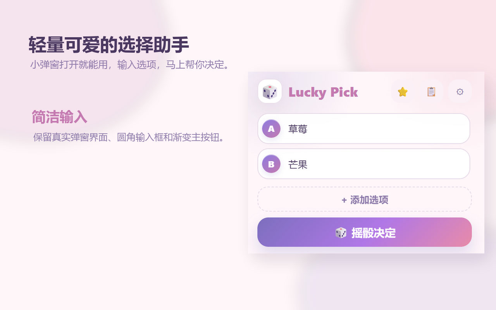
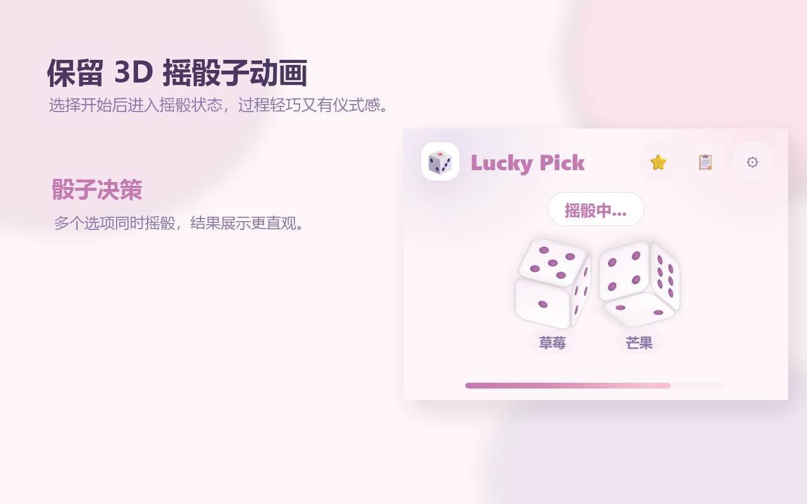
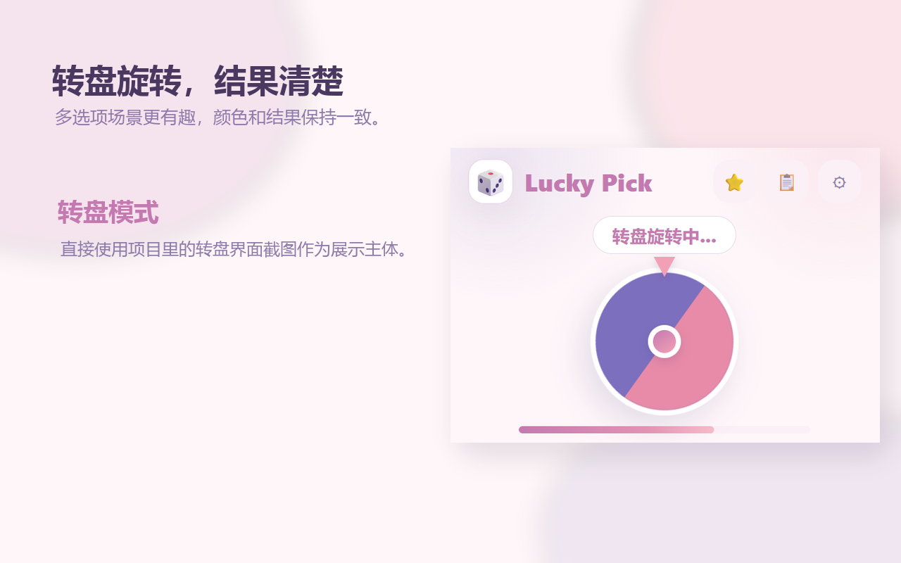
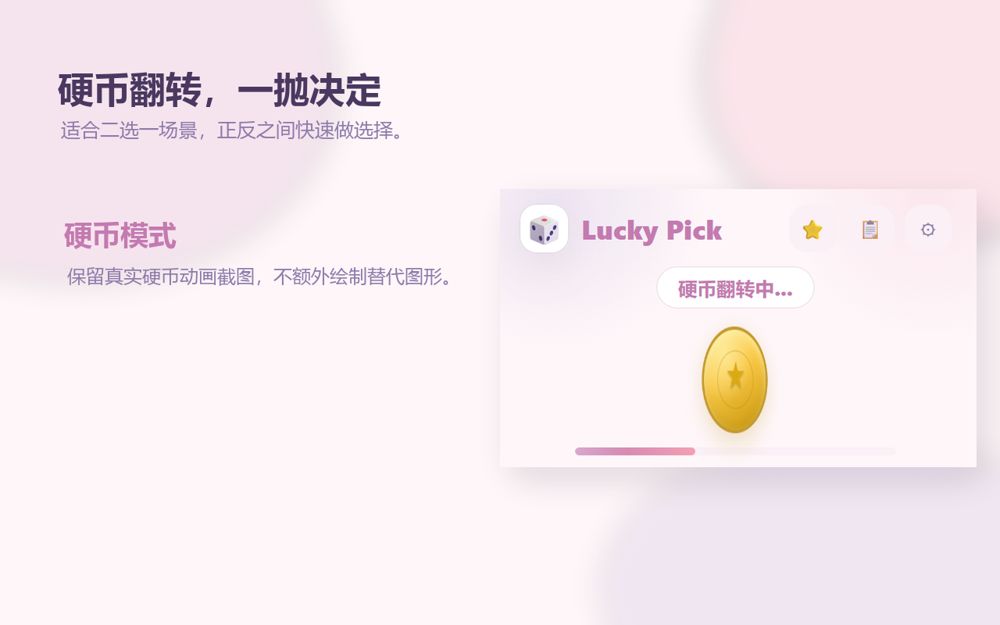
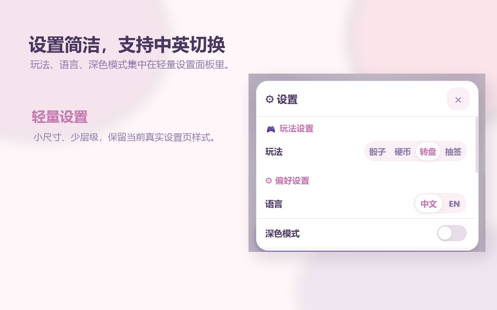

# Lucky Pick 🎲

> 选择困难症小助手 — 让幸运替你决定。
>
> Can't decide? Let luck choose for you.

**Lucky Pick** 是一款轻量级的 Chrome 扩展，专为选择困难症打造。输入你的选项，通过骰子、硬币、转盘或抽签四种随机模式帮你做出决定。纯本地运行，无需任何网络权限，尊重你的隐私。

---

## ✨ 功能特性

### 🎯 四种选择模式

| 模式 | 图标 | 说明 |
|------|------|------|
| **骰子模式** | 🎲 | 每个选项对应一个骰子，摇出最大点数的选项获胜 |
| **硬币模式** | 🪙 | 经典抛硬币，前两个选项对应正面/反面 |
| **转盘模式** | 🎡 | 可视化彩色转盘，指针随机停在某个选项上 |
| **抽签模式** | 🎰 | 老虎机式滚动抽签，动画效果酷炫 |

### 🛠️ 核心功能

- **选项管理** — 支持 2~6 个选项，实时检测并标记重复输入
- **历史记录** — 自动保存最近 50 条选择记录，支持单条删除和清空，可一键加载历史记录中的选项重新抽取
- **收藏夹** — 保存常用选项组合（带自定义名称），一键加载重复使用
- **图片导出** — 将选择结果导出为 PNG 图片（440×300，自动适配亮色/暗色主题）
- **彩纸庆祝** 🎊 — 每次出结果时彩色纸屑飘落动画
- **音效系统** 🔊 — 使用 Web Audio API 生成逼真音效（骰子摇动、硬币叮当、转盘减速、抽签咔咔、胜利和弦、点击音效），支持开关
- **键盘快捷键** — `Enter` 触发选择，`Escape` 关闭面板
- **按钮涟漪效果** — 点击按钮时有水波纹动画
- **Toast 提示** — 轻量级操作反馈提醒
- **确认对话框** — 删除/加载等操作有确认提示，防止误操作

### 🎨 个性化设置

- **深色模式** 🌙 — 亮色/暗色主题自由切换
- **多语言** 🌍 — 简体中文 / English 双语支持，可动态切换
- **无痕模式** 🕶️ — 开启后不保存历史记录
- **动画速度** ⏱️ — 支持正常、快速、慢速三种动画速度
- **状态恢复** — 关闭弹窗后重新打开，自动恢复上次输入的选项和当前模式

---

## 📥 安装

### 从源码安装（开发者模式）

1. **克隆仓库**
   ```bash
   git clone https://github.com/vaxicy/LuckyPick.git
   ```

2. **加载到 Chrome**
   - 打开 Chrome 浏览器，访问 `chrome://extensions/`
   - 开启右上角的「开发者模式」
   - 点击「加载已解压的扩展程序」
   - 选择本项目文件夹

### 从 Chrome Web Store 安装

> 即将上架，敬请期待！

---

## 🚀 使用指南

1. 点击浏览器工具栏的 Lucky Pick 图标（🎲）
2. 在输入框中填写至少 2 个选项（最多 6 个）
3. 点击右上角 ⚙️ 选择模式（骰子 / 硬币 / 转盘 / 抽签）
4. 点击中央主按钮（按钮文字随模式变化）
5. 观看动画，等待结果揭晓 🎉
6. 点击「再来一次」重新输入，或「导出」保存结果为图片

### 快捷操作

- 点击「📋 历史」查看过往选择记录
- 点击「⭐ 收藏」保存当前选项组合
- 点击 ⚙️ 进入设置面板调整偏好
- `Enter` 快速触发选择，`Escape` 关闭弹窗

---

## 📸 截图预览

| 主界面 | 骰子动画 | 转盘模式 |
|:---:|:---:|:---:|
|  |  |  |

| 硬币模式 | 设置面板 |
|:---:|:---:|
|  |  |

---

## 🧩 项目结构

```
LuckyPick/
├── manifest.json            # 扩展配置文件 (Manifest V3)
├── popup.html               # 弹窗主界面
├── popup.js                 # 核心逻辑（~1800 行）
├── popup.css                # 弹窗样式（~1850 行）
├── background.js            # 后台 Service Worker
├── donate.html              # 赞赏页面
├── LICENSE                  # 非商业使用许可证
├── icons/                   # 扩展图标 (16/48/128 px)
│   ├── icon-16.png
│   ├── icon-48.png
│   └── icon-128.png
├── _locales/                # 国际化翻译文件
│   ├── zh_CN/messages.json
│   └── en/messages.json
├── assets/                  # 静态资源（赞赏码等）
├── store-screenshots/       # Chrome Web Store 截图素材
│   ├── en/                  # 英文版截图
│   ├── promo-marquee-1400x560.png
│   ├── promo-small-440x280.png
│   └── ...
└── tools/                   # 开发工具脚本
    └── *.py                 # 截图自动生成脚本
```

---

## 🔧 技术栈

| 技术 | 用途 |
|------|------|
| **Chrome Extension Manifest V3** | 扩展框架 |
| **Vanilla JavaScript (ES6+)** | 全部逻辑，零第三方依赖 |
| **CSS3** | 样式、动画、Flexbox、Grid、3D Transform、CSS 变量 |
| **CSS 自定义属性** | 亮色/暗色主题切换 |
| **Chrome Storage API (local)** | 设置、历史、收藏、状态持久化 |
| **Web Audio API** | 纯代码生成的音效（无音频文件） |
| **Canvas API** | 结果图片导出 |
| **Chrome i18n API** | 国际化 |
| **SVG** | 硬币正面图案 |
| **Service Worker** | 后台初始化脚本 |

---

## 📄 许可

本项目使用 **非商业使用许可证 (Non-Commercial License)**。

- ✅ 个人使用、学习研究、非商业分发
- ❌ 未经许可不得用于商业用途

详见 [LICENSE](./LICENSE) 文件。如需商业许可，请联系作者。

---

## 📬 联系方式

- 提出 Issue：https://github.com/vaxicy/LuckyPick/issues
- 如果这个扩展帮助了你，欢迎[打赏支持](./donate.html) ☕

---

**享受决定的乐趣吧！Let luck choose for you!** 🎲✨
